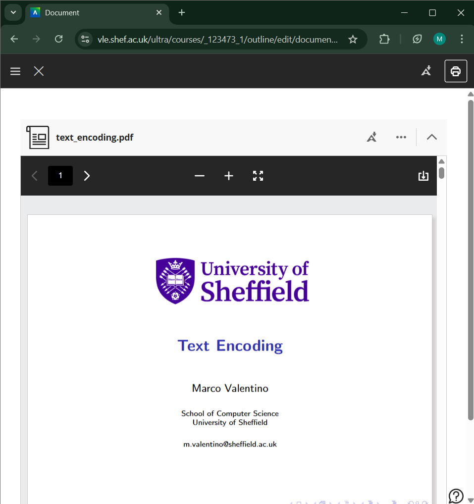
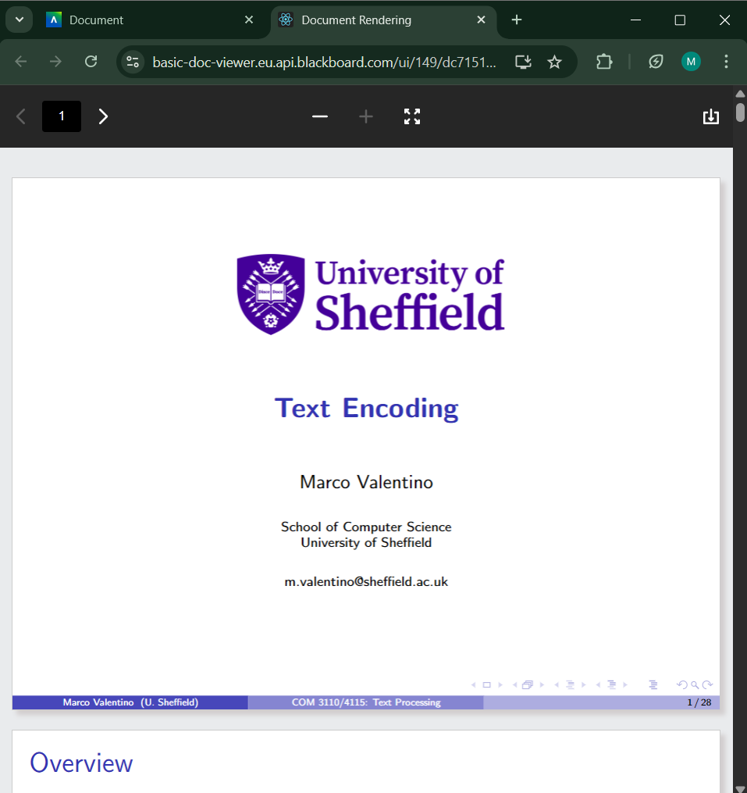

# Blackboard Ultra External File Viewer

A browser extension that automatically opens linked documents in a new tab for a better viewing experience.

<strong>Turns your half-screen lecture slides from this → into this:</strong>

  
  &nbsp;&nbsp;&nbsp;&nbsp;
  

<strong>No additional clicks required.</strong>

## Installation
1. Clone this repository.
1. Go to the Extensions page by entering `chrome://extensions` in a new tab.
    - Alternatively, click the Extensions menu puzzle button and select **Manage Extensions** at the bottom of the menu.
    - Or, click the Chrome menu, hover over **More Tools**, then select Extensions.
1. Enable Developer Mode by clicking the toggle switch next to **Developer mode**.
1. Click the **Load unpacked** button and select the cloned directory

## Usage
 Navigate to any Blackboard Ultra course materials. When you click on the linked document, it will automatically open in a new tab as well as the embedded viewer.
